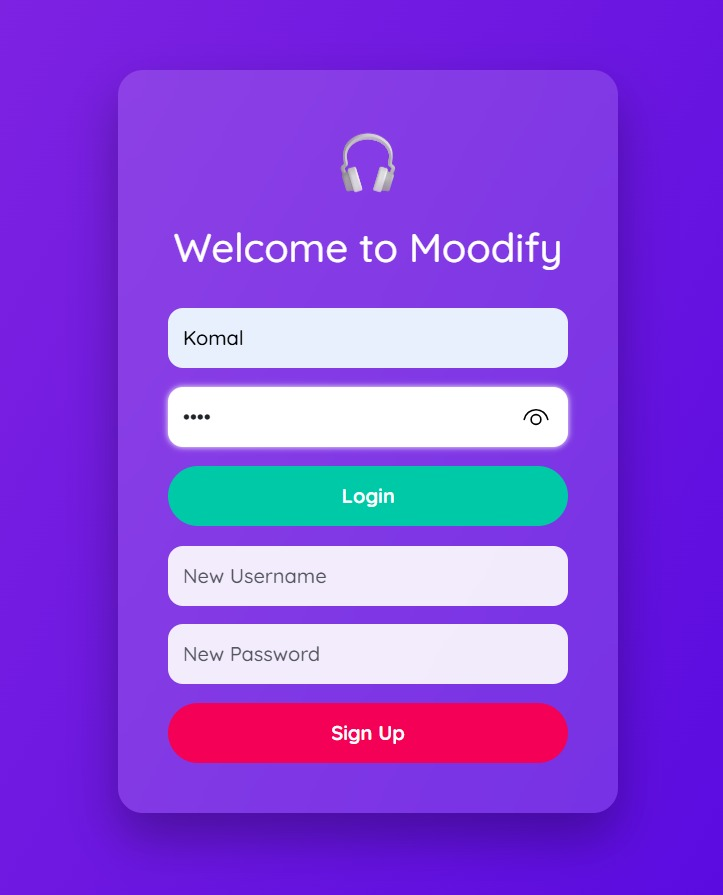
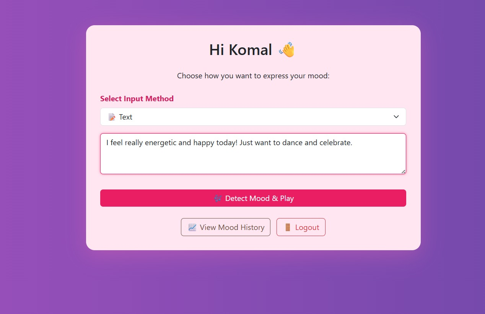
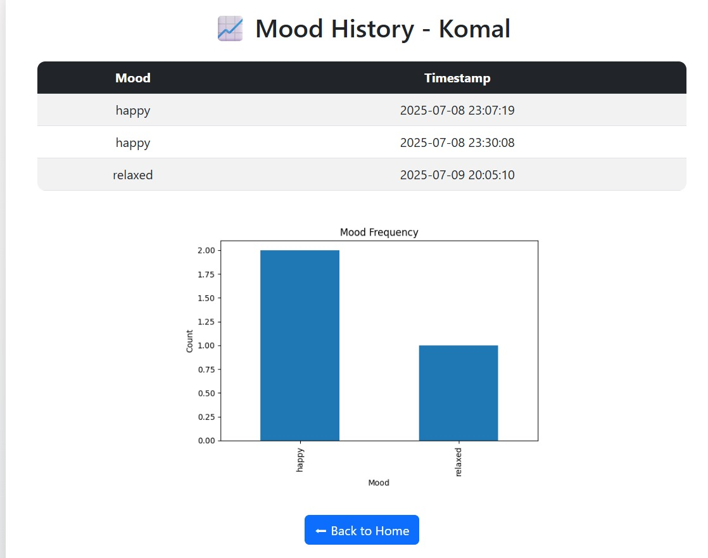
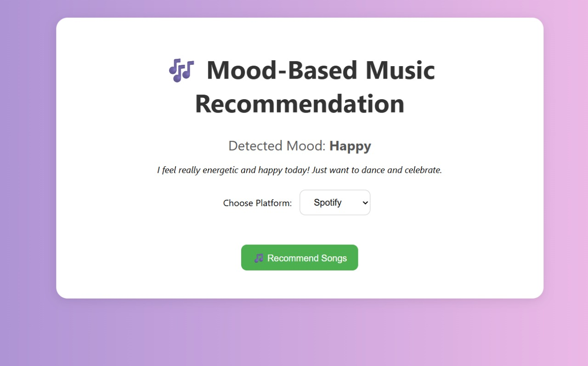
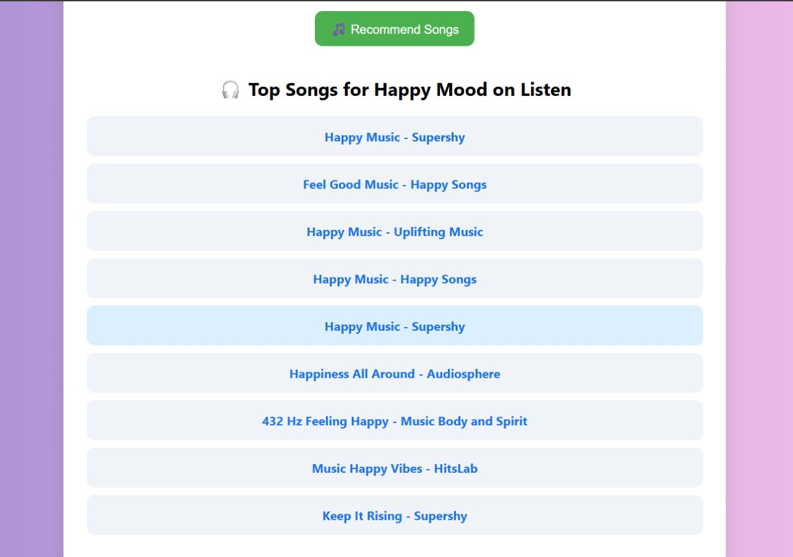
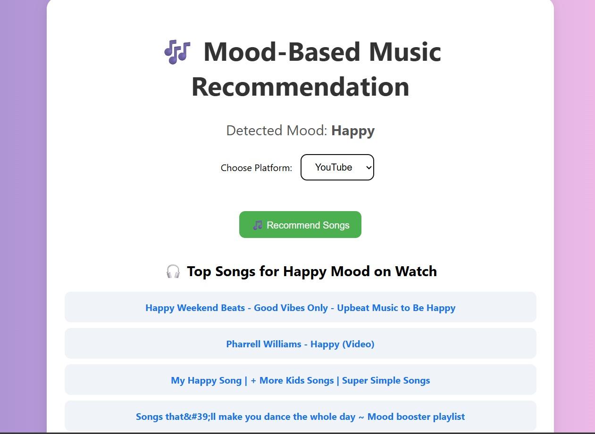

# 🎵 Moodify: A Mood-Based Music Recommendation System

Moodify

is a web application built using Flask that intelligently detects a user's mood and recommends personalized songs. It supports multiple input modalities (text, voice, and facial expression) and integrates with both **Spotify** and **YouTube** to deliver music that matches the user's current emotional state.

---------------------------------------------------------------------------------------------------------------------------------------
🚀 Features

- 🧠 Mood Detection using:
  - Textual input (user's feelings in words)
  - Voice input (speech-to-text emotion analysis)
  - Facial expressions (via webcam and OpenCV)

- 🎧 Personalized Song Recommendations:
  - Recommends 10 songs based on detected mood
  - User chooses preferred platform: *Spotify* or *YouTube*

- 👤 User Authentication:
  - Sign up and login system with session management

- 📊 Mood History Tracking:
  - Visualize past moods with simple charts

- 🖥️ Modern User Interface:
  - Clean, responsive UI using Bootstrap 5

----------------------------------------------------------------------------------------------------------------------------------------

## 🛠️ Tech Stack

| Category       | Technology                                       |
|----------------|--------------------------------------------------|
| Frontend       | HTML5, CSS3, Bootstrap 5                         |
| Backend        | Python, Flask                                    |
| APIs           | Spotify Web API, YouTube Data API v3             |
| Libraries      | Spotipy, Google API Client, OpenCV, SpeechRecognition |
| Data Storage   | SQLite                                           |

----------------------------------------------------------------------------------------------------------------------------------------

## 📁 Project Structure

      moodify/
      ├── app.py
      ├── modules/
      │ ├── auth_module.py
      │ ├── emotion_detector.py
      │ ├── music_recommender.py
      │ └── history_tracker.py
      ├── templates/
      │ ├── login.html
      │ ├── index.html
      │ ├── result.html
      │ └── history.html
      ├── static/
      │ └── style.css
      ├── requirements.txt
      └── .gitignore

---------------------------------------------------------------------------------------------------------------------------------------

**Setup Instructions**

  1. Clone the repository

          git clone https://github.com/komalpadval13/moodify-music-recommender.git
          cd moodify

  2. Install dependencies

         pip install -r requirements.txt

  3. Configure API Keys
     Replace the placeholders in music_recommender.py with your own credentials: 
      - Spotify: Get from Spotify Developer Dashboard 
      - YouTube: Get from Google Cloud Console 

     replace it with your API keys 

          SPOTIFY_CLIENT_ID = 'your_client_id'
          SPOTIFY_CLIENT_SECRET = 'your_client_secret'
          YOUTUBE_API_KEY = 'your_youtube_api_key'

  5. Run the Flask app using the below command

         python app.py

      Navigate to http://127.0.0.1:5000 in your browser.

---------------------------------------------------------------------------------------------------------------------------------------
# 📸 Screenshots

🔐 Login Page

😊 Mood Input Page

Mood History Page

🎵 Recommendation Result Page - Spotify

🎬 Recommendation Result Page - YouTube

🎶 Recommendation Result Page - Final UI

----------------------------------------------------------------------------------------------------------------------------------------
👩‍💻 **Author**

 Komal Padval

Bachelor of Engineering in AI & Data Science

---------------------------------------------------------------------------------------------------------------------------------------

 📃 **License**

 This project is intended for educational and academic use only.